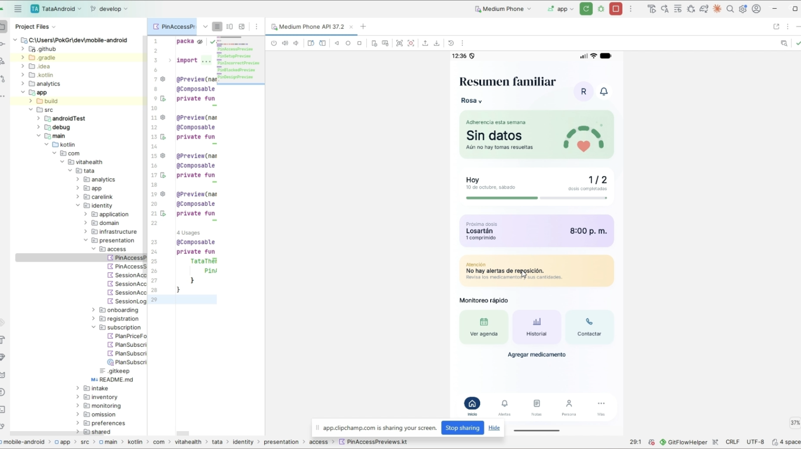
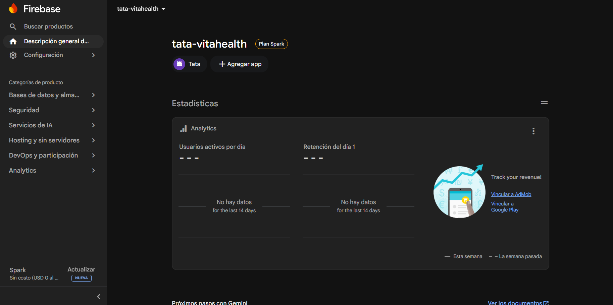
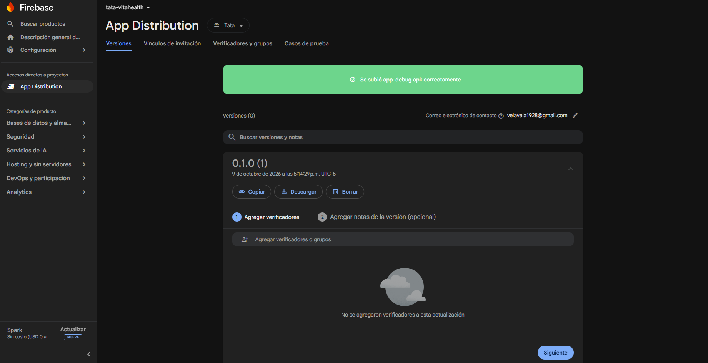
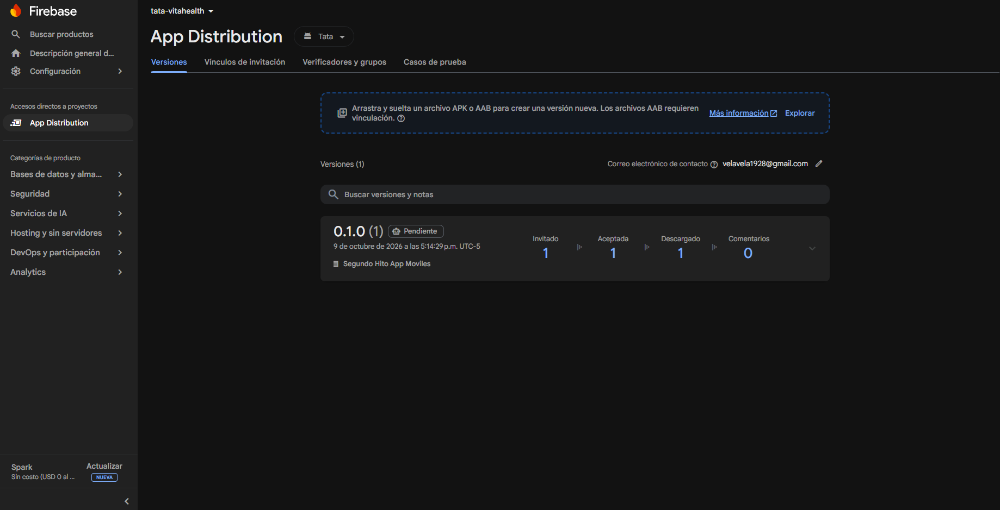
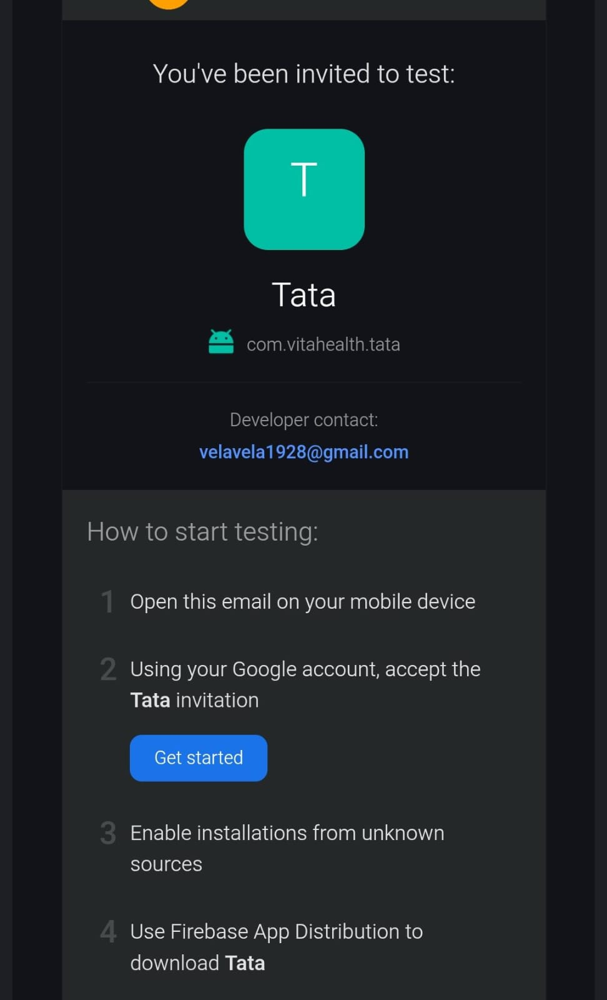

# Capítulo IV: Product Implementation & Validation

## 4.1. Software Configuration Management

### 4.1.1. Software Development Environment Configuration

El equipo utiliza herramientas de planificación, diseño, desarrollo y despliegue para la landing, los servicios web y la aplicación Android.

| Actividad | Herramientas | Uso |
| --- | --- | --- |
| Planificación | Trello y GitHub | Historias, tareas y control de versiones |
| Diseño | Figma, UXPressia y Miro | Interfaces y artefactos de diseño |
| Landing | WebStorm, HTML, CSS y JavaScript | Desarrollo del sitio responsive |
| Servicios web | IntelliJ IDEA, Java, Spring Boot y Maven | API REST y pruebas |
| Android | Android Studio, Kotlin, Compose y Gradle | Aplicación nativa y pruebas |
| Persistencia | PostgreSQL y Room | Datos del servicio y almacenamiento local |
| Integración y despliegue | GitHub Actions, Render, Neon y GitHub Pages | Compilación, pruebas y publicación |

Enlace a tablero:

https://trello.com/b/wuHmMypU/apps-moviles

Enlace a Figma:

https://www.figma.com/design/jCppvxtSpLpHOrC3ZWUIVC/VitaHealth

Enlace a Android Studio:

https://developer.android.com/studio

Enlace a Spring Boot:

https://spring.io/projects/spring-boot

### 4.1.2. Source Code Management

El equipo trabaja con GitFlow. Las historias se desarrollan en ramas feature, se revisan mediante Pull Requests y se integran en develop; las versiones estables se publican desde main con una etiqueta de release.

| Rama | Uso |
| --- | --- |
| main | Versiones estables |
| develop | Integración del trabajo |
| feature/ | Desarrollo de historias |
| fix/ | Correcciones |
| release/ | Preparación de versiones |
| hotfix/ | Correcciones de una versión publicada |

Los commits utilizan Conventional Commits, con tipo, alcance y descripción. Las releases siguen Semantic Versioning; v1.0.0 identifica la versión publicada de los productos.

**Landing Page**

<p align="center">
  
</p>

*Figura. Repositorio de Landing Page en GitHub.*

Enlace a repositorio:

https://github.com/vitaHealth-UPC/landing-page/tree/develop

**Web Services**

<p align="center">
  
</p>

*Figura. Repositorio de Web Services en GitHub.*

Enlace a repositorio:

https://github.com/vitaHealth-UPC/web-services/tree/develop

**Aplicación Android**

<p align="center">
  
</p>

*Figura. Repositorio de Aplicación Android en GitHub.*

Enlace a repositorio:

https://github.com/vitaHealth-UPC/mobile-android/tree/develop

### 4.1.3. Source Code Style Guide & Conventions

El código utiliza nombres en inglés y conceptos del dominio. Los textos de la interfaz se mantienen en recursos; el español es el idioma inicial y la función de idioma habilita la variante EN.

| Tecnología | Convenciones |
| --- | --- |
| HTML | Elementos semánticos, etiquetas y atributos en minúsculas |
| CSS | Clases descriptivas, variables de diseño y reglas responsive |
| JavaScript | lowerCamelCase, funciones breves y textos de interfaz separados |
| Java | Clases en PascalCase, métodos en lowerCamelCase y paquetes por bounded context y capa |
| Kotlin | Composables en PascalCase, estado en ViewModels y módulos por bounded context |
| SQL | Nombres consistentes y relaciones definidas mediante claves |
| Pruebas | Nombres que describen el comportamiento y resultado esperado |
| Git | Commits con tipo y alcance; Pull Requests con descripción y validación |

### 4.1.4. Software Deployment Configuration

GitHub Actions publica la landing en GitHub Pages. Render construye el backend desde su Dockerfile y utiliza PostgreSQL en Neon; Android recibe la URL del servicio mediante TATA_API_BASE_URL.

| Producto | Configuración |
| --- | --- |
| Landing | Workflow .github/workflows/pages.yml y publicación en GitHub Pages |
| Backend | Dockerfile, perfil prod, PORT y variables de conexión a PostgreSQL |
| Base de datos | Conexión administrada con credenciales en el entorno del servicio |
| Android | Compilación de APK con Gradle y API_BASE_URL en BuildConfig |

```powershell
.\gradlew.bat :app:assembleDebug -PTATA_API_BASE_URL=https://web-services-yzxl.onrender.com/
```

<p align="center">
  
</p>

*Figura. Diagrama de despliegue de Tata.*

Enlace a landing:

https://vitahealth-upc.github.io/landing-page/

Enlace a Swagger UI:

https://web-services-yzxl.onrender.com/swagger-ui/index.html

## 4.2. Landing Page & Mobile Application Implementation

### 4.2.1. Sprint 1

#### 4.2.1.1. Sprint Planning 1

Sprint 1 reúne el acceso y la vinculación familiar, la configuración del tratamiento, la próxima toma y la landing. El alcance comprende 25 historias y 81 Story Points.

| Campo | Detalle |
| --- | --- |
| **Sprint #** | Sprint 1 |
| **Sprint Planning Background** | |
| Date | 2026-09-28 (fecha propuesta para el cronograma del Sprint 1) |
| Time | 19:00, hora de Perú (horario propuesto) |
| Location | Reunión virtual (modalidad propuesta) |
| Prepared By | Diaz Yurivilca, Sofia |
| Attendees (to the meeting) | Quispe Pérez, Eder Edu / Diaz Yurivilca, Sofia / Morales Venegas, David Joel / Cabrera Novoa, Leonardo Moises / Alfaro Mallma, Joaquín Alberto / Velasquez Laquihuanaco, Eduardo David |
| **Sprint 0 Review Summary** | |
| Review | El antecedente del Sprint 1 comprende la definición del producto, requisitos y diseño de la solución. |
| Retrospective Summary | El equipo organiza el trabajo por historias y bounded contexts, con revisión de cambios mediante Pull Requests. |
| **Sprint Goal & User Stories** | |
| Sprint 1 Goal | Nuestro foco es ofrecer al familiar un recorrido desde conocer Tata hasta configurar el cuidado del adulto mayor. Esto facilita el acceso al producto y la organización de su medicación. El cumplimiento se evalúa mediante registro, vínculo con consentimiento, tratamiento y consulta de la próxima toma. |
| Sprint 1 Velocity | 81 Story Points (asignación inicial del Product Backlog; primer sprint, sin velocidad histórica previa) |
| Sum of Story Points | 81 Story Points |

**User Stories incluidas en el Sprint 1**

| Story ID | Título | Epic | Story Points |
| --- | --- | --- | --- |
| US-05 | Recordatorio de toma de medicamento | EPIC-03 | 3 |
| US-03 | Registro de un nuevo medicamento | EPIC-02 | 5 |
| US-02 | Vinculación con la cuenta del adulto mayor | EPIC-01 | 5 |
| US-14 | Creación de un tratamiento | EPIC-02 | 3 |
| US-15 | Definición de dosis y frecuencia | EPIC-02 | 3 |
| US-16 | Configuración de horarios e instrucciones | EPIC-02 | 3 |
| US-17 | Configuración de recordatorios | EPIC-02 | 3 |
| US-20 | Consulta de la próxima toma | EPIC-03 | 2 |
| US-46 | Consulta de la propuesta de valor de Tata | EPIC-09 | 2 |
| US-47 | Consulta de funcionalidades principales | EPIC-09 | 2 |
| US-49 | Continuación hacia registro o contacto | EPIC-09 | 2 |
| US-50 | Acceso adaptable al Landing Page | EPIC-09 | 3 |
| US-48 | Comparación de planes disponibles | EPIC-09 | 2 |
| US-10 | Registro de cuenta del familiar | EPIC-01 | 3 |
| US-11 | Verificación del correo del familiar | EPIC-01 | 2 |
| US-01 | Ingreso simplificado a la aplicación | EPIC-01 | 3 |
| US-12 | Registro del perfil del adulto mayor | EPIC-01 | 3 |
| US-13 | Consentimiento para establecer el vínculo | EPIC-01 | 3 |
| TS-03 | API de medicamentos y tratamientos | EPIC-02 | 5 |
| TS-08 | Servicio de generación de agenda de tomas | EPIC-03 | 5 |
| TS-02 | API de vinculación de cuidado | EPIC-01 | 5 |
| TS-07 | API de cuenta y sesión del familiar | EPIC-01 | 5 |
| TS-01 | Servicio de autenticación mediante PIN | EPIC-01 | 3 |
| SP-01 | Investigación de reconocimiento de voz | EPIC-03 | 3 |
| SP-03 | Investigación de ejecución en segundo plano | EPIC-03 | 3 |
| **Total** | | | **81** |

#### 4.2.1.2. Aspect Leaders and Collaborators

La matriz distribuye el liderazgo y la colaboración en los aspectos del Sprint 1. L identifica al líder y C al colaborador.

| Integrante | GitHub Username | Landing y UI | Backend | Pruebas | Reporte | Integración y release |
| --- | --- | --- | --- | --- | --- | --- |
| Morales Venegas, David Joel | David-std2 | L | C | C | C | C |
| Velasquez Laquihuanaco, Eduardo David | lalo-dev8 | C | L | C | C | C |
| Cabrera Novoa, Leonardo Moises | u202415820 | C | C | C | C | C |
| Diaz Yurivilca, Sofía | u20241a195-cmd | C | C | L | C | C |
| Alfaro Mallma, Alberto Joaquín | elprrr / elperro123xd | C | C | C | L | C |
| Quispe Pérez, Eder Edu | DuDu-0912 | C | C | C | C | L |

#### 4.2.1.3. Sprint Backlog 1

El Sprint Backlog organiza las 25 historias de Sprint 1 en tareas de implementación y revisión. Las estimaciones expresan horas de trabajo para cada tarea.

<p align="center">
  
</p>

*Figura. Tablero de Trello con las historias de Sprint 1.*

Enlace a tablero:

https://trello.com/b/wuHmMypU/apps-moviles

| Historia | Título | Task ID | Tarea | Estimación (horas) | Responsable | Estado |
| --- | --- | --- | --- | --- | --- | --- |
| US-05 | Recordatorio de toma de medicamento | S1-T01 | Implementar vista, validaciones y consumo de API | 6 | David Morales | To-review |
| US-03 | Registro de un nuevo medicamento | S1-T02 | Implementar vista, validaciones y consumo de API | 10 | David Morales | To-review |
| US-02 | Vinculación con la cuenta del adulto mayor | S1-T03 | Implementar vista, validaciones y consumo de API | 10 | David Morales | To-review |
| US-14 | Creación de un tratamiento | S1-T04 | Implementar vista, validaciones y consumo de API | 6 | David Morales | To-review |
| US-15 | Definición de dosis y frecuencia | S1-T05 | Implementar vista, validaciones y consumo de API | 6 | David Morales | To-review |
| US-16 | Configuración de horarios e instrucciones | S1-T06 | Implementar vista, validaciones y consumo de API | 6 | David Morales | To-review |
| US-17 | Configuración de recordatorios | S1-T07 | Implementar vista, validaciones y consumo de API | 6 | David Morales | To-review |
| US-20 | Consulta de la próxima toma | S1-T08 | Implementar vista, validaciones y consumo de API | 4 | David Morales | To-review |
| US-46 | Consulta de la propuesta de valor de Tata | S1-T09 | Implementar sección, adaptación responsive e idioma | 4 | David Morales | Done |
| US-47 | Consulta de funcionalidades principales | S1-T10 | Implementar sección, adaptación responsive e idioma | 4 | David Morales | Done |
| US-49 | Continuación hacia registro o contacto | S1-T11 | Implementar sección, adaptación responsive e idioma | 4 | David Morales | Done |
| US-50 | Acceso adaptable al Landing Page | S1-T12 | Implementar sección, adaptación responsive e idioma | 6 | David Morales | Done |
| US-48 | Comparación de planes disponibles | S1-T13 | Implementar sección, adaptación responsive e idioma | 4 | David Morales | Done |
| US-10 | Registro de cuenta del familiar | S1-T14 | Implementar vista, validaciones y consumo de API | 6 | David Morales | To-review |
| US-11 | Verificación del correo del familiar | S1-T15 | Implementar vista, validaciones y consumo de API | 4 | David Morales | To-review |
| US-01 | Ingreso simplificado a la aplicación | S1-T16 | Implementar vista, validaciones y consumo de API | 6 | David Morales | To-review |
| US-12 | Registro del perfil del adulto mayor | S1-T17 | Implementar vista, validaciones y consumo de API | 6 | David Morales | To-review |
| US-13 | Consentimiento para establecer el vínculo | S1-T18 | Implementar vista, validaciones y consumo de API | 6 | David Morales | To-review |
| TS-03 | API de medicamentos y tratamientos | S1-T19 | Implementar contrato y pruebas del servicio | 10 | Eduardo Velasquez | Done |
| TS-08 | Servicio de generación de agenda de tomas | S1-T20 | Implementar contrato y pruebas del servicio | 10 | Eduardo Velasquez | Done |
| TS-02 | API de vinculación de cuidado | S1-T21 | Implementar contrato y pruebas del servicio | 10 | Eduardo Velasquez | Done |
| TS-07 | API de cuenta y sesión del familiar | S1-T22 | Implementar contrato y pruebas del servicio | 10 | Eduardo Velasquez | Done |
| TS-01 | Servicio de autenticación mediante PIN | S1-T23 | Implementar contrato y pruebas del servicio | 6 | Eduardo Velasquez | Done |
| SP-01 | Investigación de reconocimiento de voz | S1-T24 | Revisar APIs Android y documentar el enfoque | 6 | Leonardo Cabrera | To-review |
| SP-03 | Investigación de ejecución en segundo plano | S1-T25 | Revisar APIs Android y documentar el enfoque | 6 | Leonardo Cabrera | To-review |

#### 4.2.1.4. Development Evidence for Sprint Review

La landing, el backend y Android se desarrollan en sus repositorios y se integran mediante Pull Requests. Los commits muestran la implementación y los ajustes de las historias.

| Repository | Branch | Commit Id | Commit Message | Commit Message Body | Committed on (Date) |
| --- | --- | --- | --- | --- | --- |
| `vitaHealth-UPC/landing-page` | `feature/pricing-support` | `f1c6d8e` | `feat: localize pricing and support` | - | 02/10/2026 |
| `vitaHealth-UPC/landing-page` | `develop` | `82d1449` | `feat: implement pricing and support` | * feat: add Figma assets for pricing and support | 02/10/2026 |
| `vitaHealth-UPC/landing-page` | `feature/cta-footer` | `f3fda48` | `feat: add Figma assets for CTA and footer` | - | 02/10/2026 |
| `vitaHealth-UPC/landing-page` | `develop` | `b43b5b3` | `feat: implement pricing and support` | * feat: add Figma assets for pricing and support | 02/10/2026 |
| `vitaHealth-UPC/landing-page` | `develop` | `8121db2` | `feat: align English and mobile landing variants with Figma` | * feat: add English and mobile Figma assets | 02/10/2026 |
| `vitaHealth-UPC/web-services` | `develop` | `e4b7f33` | `feat: list medications and treatments, expose medication lookup and document with OpenAPI` | - | 06/10/2026 |
| `vitaHealth-UPC/web-services` | `develop` | `a20c0ba` | `feat: respect the voice confirmation preference when confirming by voice` | - | 06/10/2026 |
| `vitaHealth-UPC/web-services` | `develop` | `8604122` | `feat: publish adherence patterns and consolidate weekly on a schedule` | - | 06/10/2026 |
| `vitaHealth-UPC/web-services` | `develop` | `e8b4039` | `feat: show low stock and adherence insights in the older adult status` | - | 06/10/2026 |
| `vitaHealth-UPC/web-services` | `feature/ts-10-adherence-frontend-views` | `f362d4c` | `feat(analytics): add adherence summary and insights views for the family app` | - | 06/10/2026 |
| `vitaHealth-UPC/mobile-android` | `feature/ts-10-adherence-entry-point` | `84c8ee7` | `feat(analytics): show recent intakes classified as on time, late or omitted` | - | 06/10/2026 |
| `vitaHealth-UPC/mobile-android` | `feature/ts-10-adherence-entry-point` | `73ea0e4` | `feat(analytics): show detected omission pattern card linked to recommendations` | - | 06/10/2026 |
| `vitaHealth-UPC/mobile-android` | `feature/ts-10-adherence-entry-point` | `22b494f` | `feat(analytics): connect the adherence screens to the backend endpoints` | - | 06/10/2026 |
| `vitaHealth-UPC/mobile-android` | `feature/ts-10-adherence-entry-point` | `b3a71dc` | `feat(app): open the adherence history from the family summary` | - | 07/10/2026 |
| `vitaHealth-UPC/mobile-android` | `feature/ts-10-adherence-entry-point` | `ec5b326` | `feat(analytics): show the caregiver tab bar in the adherence screens` | - | 07/10/2026 |

<p align="center">
  
</p>

*Figura. Historial de commits de landing-page.*

Enlace a commits:

https://github.com/vitaHealth-UPC/landing-page/commits/develop/

<p align="center">
  
</p>

*Figura. Historial de commits de web-services.*

Enlace a commits:

https://github.com/vitaHealth-UPC/web-services/commits/develop/

<p align="center">
  
</p>

*Figura. Historial de commits de mobile-android.*

Enlace a commits:

https://github.com/vitaHealth-UPC/mobile-android/commits/develop/

#### 4.2.1.5. Testing Suite Evidence for Sprint Review

El backend utiliza JUnit y pruebas de integración con Spring Boot y MockMvc. Android incorpora pruebas unitarias y pruebas instrumentadas de Compose; la ejecución visual en el emulador registra 21 pruebas, sin fallos ni errores.

| Prueba | Historias | Comportamiento |
| --- | --- | --- |
| AccountTest y PinCredentialTest | US-01, US-10, US-11 | Cuenta, credenciales y PIN |
| CareLinkTest | US-02, US-13 | Solicitud y consentimiento del vínculo |
| TreatmentTest y TreatmentAuthorizationTest | US-14 a US-19 | Pauta, activación, pausa y autorización |
| GenerateIntakesCommandHandlerTest | TS-08, US-20 | Generación de tomas programadas |
| IntakeAgendaIntegrationTest | US-24 | Orden, rango temporal y aislamiento por adulto mayor |
| IntakeConfirmationIntegrationTest | US-06 | Confirmación de tomas y resultados de la API |
| InventoryControllerTest e IntakeInventoryIntegrationTest | US-40 a US-43 | Stock y reposición |
| ExistingScreensVisualAuditTest | Vistas Android | Estados, idioma, navegación y capturas de componentes |

Enlace a pruebas del backend:

https://github.com/vitaHealth-UPC/web-services/tree/develop/src/test

Enlace a pruebas Android:

https://github.com/vitaHealth-UPC/mobile-android/tree/develop/app/src

Enlace a pruebas instrumentadas:

https://github.com/vitaHealth-UPC/mobile-android/blob/develop/app/src/androidTest/kotlin/com/vitahealth/tata/ExistingScreensVisualAuditTest.kt

**Prueba de tratamiento**

```java
@Test
void incompleteTreatmentCannotActivate() {
    var treatment = Treatment.create("adult-1", "Control de presión",
        Instant.parse("2026-10-05T12:00:00Z"));
    assertEquals(TreatmentStatus.DRAFT, treatment.status());
    assertThrows(IllegalStateException.class, treatment::activate);
}
```

Enlace a TreatmentTest:

https://github.com/vitaHealth-UPC/web-services/blob/develop/src/test/java/com/tata/treatmentmanagement/domain/model/aggregates/TreatmentTest.java

| Repositorio | Commit | Avance en pruebas | Fecha |
| --- | --- | --- | --- |
| web-services | 7618f5e | Sesiones, consentimiento y autorización | 07/10/2026 |
| mobile-android | 686eebb | Inicio de sesión e idioma en pruebas instrumentadas | 07/10/2026 |

<p align="center">
  
</p>

*Figura. Backend CI con ejecución exitosa.*

Enlace a ejecución:

https://github.com/vitaHealth-UPC/web-services/actions/runs/37647569632

<p align="center">
  
</p>

*Figura. Android CI con ejecución exitosa.*

Enlace a ejecución:

https://github.com/vitaHealth-UPC/mobile-android/actions/runs/37727256292

#### 4.2.1.6. Execution Evidence for Sprint Review

La landing presenta la propuesta, funcionalidades, planes y contacto. Android reúne las vistas de acceso, tratamiento y seguimiento; las siguientes capturas muestran su ejecución en el emulador con datos de prueba.

Enlace a landing:

https://vitahealth-upc.github.io/landing-page/

<p align="center">
  
</p>

*Figura. Encabezado y propuesta de valor.*

<p align="center">
  
</p>

*Figura. Funcionalidades de Tata.*

<p align="center">
  
</p>

*Figura. Presentación de la aplicación y pasos de uso.*

<p align="center">
  
</p>

*Figura. Testimonio e historia del producto.*

<p align="center">
  
</p>

*Figura. Planes y soporte.*

<p align="center">
  
</p>

*Figura. Contacto y pie de página.*

<p align="center">
  
</p>

*Figura. Landing en formato móvil.*

<p align="center">
  
</p>

*Figura. Acceso, registro y vinculación en Android.*

<p align="center">
  
</p>

*Figura. Medicamento, tratamiento e inventario en Android.*

<p align="center">
  
</p>

*Figura. Resumen familiar, adherencia y notificaciones en Android.*

**Video de ejecución**

<p align="center">
  <a href="https://upcedupe-my.sharepoint.com/:v:/g/personal/u202415820_upc_edu_pe/IQCB84CBuGz_T5NngWc1a80SAdKHBcArMUcdP7DEkmu17-M?nav=eyJyZWZlcnJhbEluZm8iOnsicmVmZXJyYWxBcHAiOiJPbmVEcml2ZUZvckJ1c2luZXNzIiwicmVmZXJyYWxBcHBQbGF0Zm9ybSI6IldlYiIsInJlZmVycmFsTW9kZSI6InZpZXciLCJyZWZlcnJhbFZpZXciOiJNeUZpbGVzTGlua0NvcHkifX0&e=N23NX3">
    
  </a>
</p>

*Figura. Video de ejecución del Sprint 1: recorrido por el Landing Page desplegado y las vistas de la aplicación Android conectadas al backend en Render.*

Enlace a video: [Video de ejecución del Sprint 1](https://upcedupe-my.sharepoint.com/:v:/g/personal/u202415820_upc_edu_pe/IQCB84CBuGz_T5NngWc1a80SAdKHBcArMUcdP7DEkmu17-M?nav=eyJyZWZlcnJhbEluZm8iOnsicmVmZXJyYWxBcHAiOiJPbmVEcml2ZUZvckJ1c2luZXNzIiwicmVmZXJyYWxBcHBQbGF0Zm9ybSI6IldlYiIsInJlZmVycmFsTW9kZSI6InZpZXciLCJyZWZlcnJhbFZpZXciOiJNeUZpbGVzTGlua0NvcHkifX0&e=N23NX3) (duración: 5:25).

#### 4.2.1.7. Services Documentation Evidence for Sprint Review

En este Sprint documentamos el backend con OpenAPI y lo publicamos junto con los Web Services en Swagger UI. En total son 64 operaciones: 62 de los Bounded Contexts Identity & Subscription, Care Link, Treatment Management, Intake Execution, Family Monitoring, Adherence Analytics, Inventory & Replenishment y Accessibility & Preferences, y 2 de estado del servicio. Omission & Escalation no tiene endpoints REST, así que no aparece. Algunos endpoints pertenecen a historias que el Product Backlog asigna a sprints posteriores, pero ya estaban implementados al cerrar el Sprint 1 y por eso se documentaron aquí. Todas las llamadas llevan el encabezado `Authorization: Bearer <token>`, menos las que la tabla marca como públicas; sin el token responden `401 AUTHENTICATION_REQUIRED`. Los ejemplos de respuesta de la tabla son respuestas reales del backend desplegado, que obtuvimos con la cuenta de demostración. Tres ejemplos los armamos con la misma estructura de la respuesta real, porque no se pueden ejecutar con esa cuenta: la verificación del correo (necesita el código que todavía no se envía), la confirmación por voz (necesita el proveedor de voz) y el cambio de plan. Los endpoints de adherencia devuelven listas vacías o `204` porque la cuenta demo aún no tiene tomas pasadas.

Repositorio de Web Services: https://github.com/vitaHealth-UPC/web-services

Documentación desplegada: https://web-services-yzxl.onrender.com/swagger-ui/index.html

**Treatment Management**

| Endpoint | Acción | Verbo HTTP | Sintaxis de llamada | Parámetros | Ejemplo de response | Explicación del response | Documentación |
| --- | --- | --- | --- | --- | --- | --- | --- |
| `/api/v1/older-adults/{olderAdultId}/treatments` | Crear un tratamiento (US-14) | POST | `POST /api/v1/older-adults/{olderAdultId}/treatments` | Path: `olderAdultId`.<br>Body: `caregiverId`, `name`. | `201` `{"id":"3f6c1d0e-8a52-4f0b-9c55-2f1f4d9a7b10","olderAdultId":"00000000-0000-0000-0000-000000000001","name":"Control de presión","status":"DRAFT","medicationId":null,"dose":null,"frequency":null,"scheduledTimes":null,"instructions":null,"reminderLeadMinutes":null}` | Crea el tratamiento en estado `DRAFT`, sin pauta. `400` si falta un dato; 403 si el cuidador no tiene un vínculo de cuidado activo con el adulto mayor. | https://web-services-yzxl.onrender.com/swagger-ui/index.html · Treatments |
| `/api/v1/older-adults/{olderAdultId}/treatments` | Listar los tratamientos de un adulto mayor (US-19) | GET | `GET /api/v1/older-adults/{olderAdultId}/treatments?caregiverId={caregiverId}` | Path: `olderAdultId`.<br>Query: `caregiverId`. | `200` `[{"id":"3f6c1d0e-8a52-4f0b-9c55-2f1f4d9a7b10","olderAdultId":"00000000-0000-0000-0000-000000000001","name":"Control de presión","status":"DRAFT","medicationId":null,"dose":null,"frequency":null,"scheduledTimes":null,"instructions":null,"reminderLeadMinutes":null}]` | Devuelve la lista, del más antiguo al más reciente; vacía si no hay tratamientos. 403 si el cuidador no tiene un vínculo de cuidado activo con el adulto mayor. | https://web-services-yzxl.onrender.com/swagger-ui/index.html · Treatments |
| `/api/v1/treatments/{treatmentId}/regimen` | Configurar dosis, frecuencia, horarios, instrucciones y recordatorio (US-15, US-16, US-17) | PUT | `PUT /api/v1/treatments/{treatmentId}/regimen` | Path: `treatmentId`.<br>Body: `caregiverId`, `medicationId`, `dose`, `frequency`, `scheduledTimes` (al menos un horario), `instructions`, `reminderLeadMinutes` (0 a 1440). | `200` `{"id":"3f6c1d0e-8a52-4f0b-9c55-2f1f4d9a7b10","olderAdultId":"00000000-0000-0000-0000-000000000001","name":"Control de presión","status":"DRAFT","medicationId":"7a1b2c3d-1111-4222-8333-444455556666","dose":"1 comprimido","frequency":"DAILY","scheduledTimes":["08:00:00","20:00:00"],"instructions":"Con un vaso de agua","reminderLeadMinutes":10}` | Devuelve el tratamiento con su pauta. `400` si la pauta es inválida; `404` si no existe el tratamiento o el medicamento; `409` si el medicamento está inactivo; 403 si el cuidador no tiene un vínculo de cuidado activo con el adulto mayor. | https://web-services-yzxl.onrender.com/swagger-ui/index.html · Treatments |
| `/api/v1/treatments/{treatmentId}/activation` | Activar un tratamiento (US-18) | POST | `POST /api/v1/treatments/{treatmentId}/activation?caregiverId={caregiverId}` | Path: `treatmentId`.<br>Query: `caregiverId`. | `200` `{"id":"3f6c1d0e-8a52-4f0b-9c55-2f1f4d9a7b10","olderAdultId":"00000000-0000-0000-0000-000000000001","name":"Control de presión","status":"ACTIVE","medicationId":"7a1b2c3d-1111-4222-8333-444455556666","dose":"1 comprimido","frequency":"DAILY","scheduledTimes":["08:00:00","20:00:00"],"instructions":"Con un vaso de agua","reminderLeadMinutes":10}` | El tratamiento pasa a `ACTIVE`. `409` si la pauta está incompleta o el medicamento está inactivo; `404` si no existe; 403 si el cuidador no tiene un vínculo de cuidado activo con el adulto mayor. | https://web-services-yzxl.onrender.com/swagger-ui/index.html · Treatments |
| `/api/v1/treatments/{treatmentId}/pause` | Pausar un tratamiento (US-18) | POST | `POST /api/v1/treatments/{treatmentId}/pause?caregiverId={caregiverId}` | Path: `treatmentId`.<br>Query: `caregiverId`. | `200` `{"id":"3f6c1d0e-8a52-4f0b-9c55-2f1f4d9a7b10","olderAdultId":"00000000-0000-0000-0000-000000000001","name":"Control de presión","status":"PAUSED","medicationId":"7a1b2c3d-1111-4222-8333-444455556666","dose":"1 comprimido","frequency":"DAILY","scheduledTimes":["08:00:00","20:00:00"],"instructions":"Con un vaso de agua","reminderLeadMinutes":10}` | El tratamiento pasa a `PAUSED` y conserva la pauta y el historial. `409` si no estaba activo; `404` si no existe; 403 si el cuidador no tiene un vínculo de cuidado activo con el adulto mayor. | https://web-services-yzxl.onrender.com/swagger-ui/index.html · Treatments |
| `/api/v1/treatments/{treatmentId}/resume` | Reanudar un tratamiento pausado | POST | `POST /api/v1/treatments/{treatmentId}/resume?caregiverId={caregiverId}` | Path: `treatmentId`.<br>Query: `caregiverId`. | `200` `{"id":"3f6c1d0e-8a52-4f0b-9c55-2f1f4d9a7b10","olderAdultId":"00000000-0000-0000-0000-000000000001","name":"Control de presión","status":"ACTIVE","medicationId":"7a1b2c3d-1111-4222-8333-444455556666","dose":"1 comprimido","frequency":"DAILY","scheduledTimes":["08:00:00","20:00:00"],"instructions":"Con un vaso de agua","reminderLeadMinutes":10}` | El tratamiento vuelve a `ACTIVE`. `409` si no estaba pausado o su medicamento está inactivo; `404` si no existe; 403 si el cuidador no tiene un vínculo de cuidado activo con el adulto mayor. | https://web-services-yzxl.onrender.com/swagger-ui/index.html · Treatments |
| `/api/v1/treatments/{treatmentId}` | Consultar el detalle de un tratamiento (US-19) | GET | `GET /api/v1/treatments/{treatmentId}?caregiverId={caregiverId}` | Path: `treatmentId`.<br>Query: `caregiverId`. | `200` `{"id":"3f6c1d0e-8a52-4f0b-9c55-2f1f4d9a7b10","olderAdultId":"00000000-0000-0000-0000-000000000001","name":"Control de presión","status":"ACTIVE","medicationId":"7a1b2c3d-1111-4222-8333-444455556666","dose":"1 comprimido","frequency":"DAILY","scheduledTimes":["08:00:00","20:00:00"],"instructions":"Con un vaso de agua","reminderLeadMinutes":10}` | Devuelve el tratamiento con su pauta; los campos de la pauta son `null` mientras esté incompleto. `404` si no existe; 403 si el cuidador no tiene un vínculo de cuidado activo con el adulto mayor. | https://web-services-yzxl.onrender.com/swagger-ui/index.html · Treatments |
| `/api/v1/older-adults/{olderAdultId}/medications` | Registrar un medicamento (US-03) | POST | `POST /api/v1/older-adults/{olderAdultId}/medications` | Path: `olderAdultId`.<br>Body: `caregiverId`, `name`, `presentation`. | `201` `{"id":"7a1b2c3d-1111-4222-8333-444455556666","olderAdultId":"00000000-0000-0000-0000-000000000001","name":"Losartán","presentation":"50 mg, tableta","active":true}` | Crea el medicamento activo del adulto mayor. `400` si falta un dato obligatorio; 403 si el cuidador no tiene un vínculo de cuidado activo con el adulto mayor. | https://web-services-yzxl.onrender.com/swagger-ui/index.html · Medications |
| `/api/v1/older-adults/{olderAdultId}/medications` | Listar los medicamentos de un adulto mayor (US-03) | GET | `GET /api/v1/older-adults/{olderAdultId}/medications?caregiverId={caregiverId}` | Path: `olderAdultId`.<br>Query: `caregiverId`. | `200` `[{"id":"7a1b2c3d-1111-4222-8333-444455556666","olderAdultId":"00000000-0000-0000-0000-000000000001","name":"Losartán","presentation":"50 mg, tableta","active":true}]` | Devuelve los medicamentos ordenados por nombre, incluidos los inactivos; vacía si no hay ninguno. 403 si el cuidador no tiene un vínculo de cuidado activo con el adulto mayor. | https://web-services-yzxl.onrender.com/swagger-ui/index.html · Medications |
| `/api/v1/medications/{medicationId}` | Editar un medicamento (US-04) | PUT | `PUT /api/v1/medications/{medicationId}` | Path: `medicationId`.<br>Body: `caregiverId`, `name`, `presentation`. | `200` `{"id":"7a1b2c3d-1111-4222-8333-444455556666","olderAdultId":"00000000-0000-0000-0000-000000000001","name":"Losartán","presentation":"100 mg, tableta","active":true}` | Cambia el nombre y la presentación; los tratamientos que lo usan republican su agenda. `400` si falta un dato; `404` si no existe; `409` si está inactivo; 403 si el cuidador no tiene un vínculo de cuidado activo con el adulto mayor. | https://web-services-yzxl.onrender.com/swagger-ui/index.html · Medications |
| `/api/v1/medications/{medicationId}/deactivation` | Desactivar un medicamento (US-04) | POST | `POST /api/v1/medications/{medicationId}/deactivation?caregiverId={caregiverId}` | Path: `medicationId`.<br>Query: `caregiverId`. | `200` `{"id":"7a1b2c3d-1111-4222-8333-444455556666","olderAdultId":"00000000-0000-0000-0000-000000000001","name":"Losartán","presentation":"50 mg, tableta","active":false}` | El medicamento queda inactivo y conserva su historial; un tratamiento activo que lo use se pausa. `404` si no existe; 403 si el cuidador no tiene un vínculo de cuidado activo con el adulto mayor. | https://web-services-yzxl.onrender.com/swagger-ui/index.html · Medications |
| `/api/v1/medications/{medicationId}` | Consultar el detalle de un medicamento | GET | `GET /api/v1/medications/{medicationId}?caregiverId={caregiverId}` | Path: `medicationId`.<br>Query: `caregiverId`. | `200` `{"id":"7a1b2c3d-1111-4222-8333-444455556666","olderAdultId":"00000000-0000-0000-0000-000000000001","name":"Losartán","presentation":"50 mg, tableta","active":true}` | Devuelve el medicamento. `404` si no existe; 403 si el cuidador no tiene un vínculo de cuidado activo con el adulto mayor. | https://web-services-yzxl.onrender.com/swagger-ui/index.html · Medications |

**Accessibility & Preferences**

| Endpoint | Acción | Verbo HTTP | Sintaxis de llamada | Parámetros | Ejemplo de response | Explicación del response | Documentación |
| --- | --- | --- | --- | --- | --- | --- | --- |
| `/api/v1/users/{userId}/preferences` | Consultar las preferencias de un usuario (US-35, US-36) | GET | `GET /api/v1/users/{userId}/preferences` | Path: `userId`. | `200` `{"userId":"00000000-0000-0000-0000-000000000001","textSize":"LARGE","highContrast":false,"reducedMotion":false,"readingAssistance":false,"voiceConfirmationEnabled":true,"quietHours":{"start":"22:00:00","end":"07:00:00"},"notificationChannels":[{"type":"PUSH","enabled":true},{"type":"SMS","enabled":false},{"type":"EMAIL","enabled":false}]}` | Devuelve las preferencias de accesibilidad y de notificación. Un usuario que nunca guardó nada recibe los valores por defecto, que se guardan en esa primera lectura. | https://web-services-yzxl.onrender.com/swagger-ui/index.html · Accessibility |
| `/api/v1/users/{userId}/preferences/text-size` | Cambiar el tamaño de texto (US-35) | PUT | `PUT /api/v1/users/{userId}/preferences/text-size` | Path: `userId`.<br>Body: `textSize` (`SMALL`, `MEDIUM`, `LARGE` o `EXTRA_LARGE`). | `200` `{"userId":"00000000-0000-0000-0000-000000000001","textSize":"LARGE","highContrast":false,"reducedMotion":false,"readingAssistance":false,"voiceConfirmationEnabled":true,"quietHours":{"start":"22:00:00","end":"07:00:00"},"notificationChannels":[{"type":"PUSH","enabled":true},{"type":"SMS","enabled":false},{"type":"EMAIL","enabled":false}]}` | Devuelve las preferencias actualizadas. Cada cambio se conserva para las próximas sesiones. `400` si el tamaño no es válido. | https://web-services-yzxl.onrender.com/swagger-ui/index.html · Accessibility |
| `/api/v1/users/{userId}/preferences/contrast` | Activar o desactivar el contraste reforzado (US-36) | PUT | `PUT /api/v1/users/{userId}/preferences/contrast` | Path: `userId`.<br>Body: `enabled` (booleano). | `200` `{"userId":"00000000-0000-0000-0000-000000000001","textSize":"LARGE","highContrast":true,"reducedMotion":false,"readingAssistance":false,"voiceConfirmationEnabled":true,"quietHours":{"start":"22:00:00","end":"07:00:00"},"notificationChannels":[{"type":"PUSH","enabled":true},{"type":"SMS","enabled":false},{"type":"EMAIL","enabled":false}]}` | Devuelve las preferencias actualizadas. Cada cambio se conserva para las próximas sesiones. | https://web-services-yzxl.onrender.com/swagger-ui/index.html · Accessibility |
| `/api/v1/users/{userId}/preferences/reduced-motion` | Activar o desactivar la reducción de movimiento (US-37) | PUT | `PUT /api/v1/users/{userId}/preferences/reduced-motion` | Path: `userId`.<br>Body: `enabled` (booleano). | `200` `{"userId":"00000000-0000-0000-0000-000000000001","textSize":"LARGE","highContrast":false,"reducedMotion":true,"readingAssistance":false,"voiceConfirmationEnabled":true,"quietHours":{"start":"22:00:00","end":"07:00:00"},"notificationChannels":[{"type":"PUSH","enabled":true},{"type":"SMS","enabled":false},{"type":"EMAIL","enabled":false}]}` | Devuelve las preferencias actualizadas. Cada cambio se conserva para las próximas sesiones. | https://web-services-yzxl.onrender.com/swagger-ui/index.html · Accessibility |
| `/api/v1/users/{userId}/preferences/reading-assistance` | Activar o desactivar la ayuda de lectura (US-38) | PUT | `PUT /api/v1/users/{userId}/preferences/reading-assistance` | Path: `userId`.<br>Body: `enabled` (booleano). | `200` `{"userId":"00000000-0000-0000-0000-000000000001","textSize":"LARGE","highContrast":false,"reducedMotion":false,"readingAssistance":true,"voiceConfirmationEnabled":true,"quietHours":{"start":"22:00:00","end":"07:00:00"},"notificationChannels":[{"type":"PUSH","enabled":true},{"type":"SMS","enabled":false},{"type":"EMAIL","enabled":false}]}` | Devuelve las preferencias actualizadas. Cada cambio se conserva para las próximas sesiones. | https://web-services-yzxl.onrender.com/swagger-ui/index.html · Accessibility |
| `/api/v1/users/{userId}/preferences/voice-confirmation` | Activar o desactivar la confirmación por voz (US-06) | PUT | `PUT /api/v1/users/{userId}/preferences/voice-confirmation` | Path: `userId`.<br>Body: `enabled` (booleano). | `200` `{"userId":"00000000-0000-0000-0000-000000000001","textSize":"LARGE","highContrast":false,"reducedMotion":false,"readingAssistance":false,"voiceConfirmationEnabled":false,"quietHours":{"start":"22:00:00","end":"07:00:00"},"notificationChannels":[{"type":"PUSH","enabled":true},{"type":"SMS","enabled":false},{"type":"EMAIL","enabled":false}]}` | Devuelve las preferencias actualizadas. Solo guarda la preferencia; el reconocimiento de voz pertenece a Intake Execution. | https://web-services-yzxl.onrender.com/swagger-ui/index.html · Accessibility |
| `/api/v1/users/{userId}/notification-preferences` | Configurar el horario de silencio y los canales de notificación (US-39) | PUT | `PUT /api/v1/users/{userId}/notification-preferences` | Path: `userId`.<br>Body: `quietHours` (`start` y `end`, o `null` para quitarlo), `channels` (lista de `type` y `enabled`; `PUSH`, `SMS` o `EMAIL`, sin repetir). | `200` `{"userId":"00000000-0000-0000-0000-000000000001","textSize":"LARGE","highContrast":false,"reducedMotion":false,"readingAssistance":false,"voiceConfirmationEnabled":true,"quietHours":{"start":"22:00:00","end":"07:00:00"},"notificationChannels":[{"type":"PUSH","enabled":true},{"type":"SMS","enabled":false},{"type":"EMAIL","enabled":false}]}` | Reemplaza ambos ajustes a la vez y devuelve las preferencias. El horario puede cruzar la medianoche. `400` si inicio y fin son iguales o se repite un canal. | https://web-services-yzxl.onrender.com/swagger-ui/index.html · Notification Preferences |

**Identity & Subscription**

| Endpoint | Acción | Verbo HTTP | Sintaxis de llamada | Parámetros | Ejemplo de response | Explicación del response | Documentación |
| --- | --- | --- | --- | --- | --- | --- | --- |
| `/api/v1/email-verification-requests` | Solicitar el código de verificación del correo | POST | `POST /api/v1/email-verification-requests` | Body: `email`. | `202` `{"id":"171efb94-a7d9-48b6-b968-73f09cdc7e31","name":"Ana Torres","email":"ana.torres.docs@tata.app","status":"PENDING_VERIFICATION","accessToken":null,"expiresAt":null}` | Solicita el envío del código de verificación; responde `202`. `400` si el correo falta o no es válido. No requiere token. | https://web-services-yzxl.onrender.com/swagger-ui/index.html · email-verification-requests-controller |
| `/api/v1/accounts` | Crear una cuenta | POST | `POST /api/v1/accounts` | Body: `name`, `email`, `password`. | `201` `{"id":"171efb94-a7d9-48b6-b968-73f09cdc7e31","name":"Ana Torres","email":"ana.torres.docs@tata.app","status":"PENDING_VERIFICATION","accessToken":null,"expiresAt":null}` | Crea la cuenta y devuelve sus datos y el token de acceso. `400` si faltan datos. No requiere token. | https://web-services-yzxl.onrender.com/swagger-ui/index.html · accounts-controller |
| `/api/v1/accounts/verification` | Verificar el correo con el código recibido | POST | `POST /api/v1/accounts/verification` | Body: `email`, `code`. | `200` `{"id":"171efb94-a7d9-48b6-b968-73f09cdc7e31","name":"Ana Torres","email":"ana.torres.docs@tata.app","status":"ACTIVE","accessToken":"0a1b2c3d-...","expiresAt":"2026-10-10T11:20:00Z"}` | Valida el código y devuelve los datos de la cuenta con el token de acceso. `401` si el código es inválido. No requiere token. | https://web-services-yzxl.onrender.com/swagger-ui/index.html · accounts-controller |
| `/api/v1/sessions` | Iniciar sesión de un cuidador o familiar | POST | `POST /api/v1/sessions` | Body: `email`, `password`. | `200` `{"accountId":"d3a10000-0000-4000-8000-000000000001","accessToken":"b646cff2-...","expiresAt":"2026-10-10T11:14:56.502817859Z"}` | Devuelve el `accessToken` y su vencimiento. `400` si faltan datos. No requiere token. | https://web-services-yzxl.onrender.com/swagger-ui/index.html · sessions-controller |
| `/api/v1/sessions/current` | Consultar la sesión actual | GET | `GET /api/v1/sessions/current` | Ninguno. | `200` `{"subjectId":"d3a10000-0000-4000-8000-000000000001","role":"CAREGIVER","expiresAt":"2026-10-10T11:14:56.502818Z","careLinkId":null,"name":"d3a10000-0000-4000-8000-000000000001"}` | Devuelve el sujeto de la sesión, su rol (`CAREGIVER` u otro), el vínculo de cuidado y el vencimiento. | https://web-services-yzxl.onrender.com/swagger-ui/index.html · session-lifecycle-controller |
| `/api/v1/sessions` | Cerrar la sesión | DELETE | `DELETE /api/v1/sessions` | Header: `Authorization`. | `204` Sin cuerpo | Invalida el token enviado en `Authorization`; responde `204` sin cuerpo. | https://web-services-yzxl.onrender.com/swagger-ui/index.html · session-lifecycle-controller |
| `/api/v1/pin-credentials` | Registrar el PIN de un adulto mayor | POST | `POST /api/v1/pin-credentials` | Body: `olderAdultId`, `pin`. | `201` Sin cuerpo | Guarda el PIN con el que el adulto mayor iniciará sesión; responde `201` sin cuerpo. | https://web-services-yzxl.onrender.com/swagger-ui/index.html · pin-credentials-controller |
| `/api/v1/pin-sessions` | Iniciar sesión de un adulto mayor con PIN | POST | `POST /api/v1/pin-sessions` | Body: `olderAdultId`, `pin`. | `200` `{"olderAdultId":"d3a10000-0000-4000-8000-000000000002","accessToken":"fb448982-...","expiresAt":"2026-10-10T11:15:00.089889817Z"}` | Devuelve el `accessToken` de la sesión del adulto mayor y su vencimiento. `400` si faltan datos. No requiere token. | https://web-services-yzxl.onrender.com/swagger-ui/index.html · pin-sessions-controller |
| `/api/v1/plans` | Listar los planes disponibles | GET | `GET /api/v1/plans` | Ninguno. | `200` `[{"code":"ESSENTIAL","name":"Esencial","monthlyPrice":9.90,"currency":"PEN","capabilities":["AGENDA","REMINDERS","INTAKE_CONFIRMATION"]},{"code":"FAMILY","name":"Familiar","monthlyPrice":19.90,"currency":"PEN","capabilities":["ADHERENCE_INSIGHTS","AGENDA","FAMILY_MONITORING","INTAKE_CONFIRMATION","REMINDERS","FAMILY_ALERTS"]}]` | Devuelve los planes con su precio mensual, moneda y capacidades. No requiere token. | https://web-services-yzxl.onrender.com/swagger-ui/index.html · Plans and subscriptions |
| `/api/v1/accounts/{accountId}/subscription` | Consultar la suscripción de una cuenta (US-44) | GET | `GET /api/v1/accounts/{accountId}/subscription` | Path: `accountId`. | `200` `{"accountId":"d3a10000-0000-4000-8000-000000000001","plan":{"code":"ESSENTIAL","name":"Esencial","monthlyPrice":9.90,"currency":"PEN","capabilities":["AGENDA","REMINDERS","INTAKE_CONFIRMATION"]},"status":"ACTIVE","renewsAt":null}` | Devuelve el plan vigente, el estado de la suscripción, la fecha de renovación y las capacidades habilitadas. | https://web-services-yzxl.onrender.com/swagger-ui/index.html · Plans and subscriptions |
| `/api/v1/accounts/{accountId}/subscription` | Activar o cambiar el plan de una cuenta (US-45) | PUT | `PUT /api/v1/accounts/{accountId}/subscription` | Path: `accountId`.<br>Body: `planCode`. | `200` `{"accountId":"d3a10000-0000-4000-8000-000000000001","plan":{"code":"FAMILY","name":"Familiar","monthlyPrice":19.90,"currency":"PEN","capabilities":["ADHERENCE_INSIGHTS","AGENDA","FAMILY_MONITORING","INTAKE_CONFIRMATION","REMINDERS","FAMILY_ALERTS"]},"status":"ACTIVE","renewsAt":"2026-11-09T12:00:00Z"}` | Aplica el plan indicado por `planCode` y devuelve la suscripción resultante. | https://web-services-yzxl.onrender.com/swagger-ui/index.html · Plans and subscriptions |

**Care Link**

| Endpoint | Acción | Verbo HTTP | Sintaxis de llamada | Parámetros | Ejemplo de response | Explicación del response | Documentación |
| --- | --- | --- | --- | --- | --- | --- | --- |
| `/api/v1/older-adults` | Registrar un adulto mayor | POST | `POST /api/v1/older-adults` | Body: `caregiverId`, `fullName`, `birthDate`, `emergencyContactName`, `emergencyContactRelationship`, `emergencyContactPhone`. | `201` `{"id":"b4dcad92-3ce9-41b4-a184-980fb819ea4e","registeredByCaregiverId":"d3a10000-0000-4000-8000-000000000001","fullName":"Carlos Mendoza","birthDate":"1950-03-02","emergencyContactName":"Lucía Mendoza","emergencyContactRelationship":"Hija","emergencyContactPhone":"+51 999 111 222","createdAt":"2026-10-09T23:15:42.388079448Z"}` | Crea el adulto mayor con su contacto de emergencia y devuelve sus datos; responde `201`. | https://web-services-yzxl.onrender.com/swagger-ui/index.html · older-adults-controller |
| `/api/v1/older-adults/{olderAdultId}` | Consultar los datos de un adulto mayor | GET | `GET /api/v1/older-adults/{olderAdultId}` | Path: `olderAdultId`. | `200` `{"id":"d3a10000-0000-4000-8000-000000000002","registeredByCaregiverId":"d3a10000-0000-4000-8000-000000000001","fullName":"Rosa Vargas","birthDate":"1948-05-12","emergencyContactName":"Diego Vargas","emergencyContactRelationship":"Son","emergencyContactPhone":"999888777","createdAt":"2026-10-09T11:23:14.137645Z"}` | Devuelve los datos del adulto mayor y de su contacto de emergencia. | https://web-services-yzxl.onrender.com/swagger-ui/index.html · older-adults-controller |
| `/api/v1/care-links/linking-codes` | Generar un código de vinculación | POST | `POST /api/v1/care-links/linking-codes` | Body: `caregiverId`, `olderAdultId`. | `201` `{"id":"73e804c9-7a0a-47a0-8f3f-c440c790c2e7","caregiverId":"d3a10000-0000-4000-8000-000000000001","olderAdultId":"b4dcad92-3ce9-41b4-a184-980fb819ea4e","status":"PENDING","linkingCode":"TATA-9620","codeExpiresAt":"2026-10-09T23:30:43.475096019Z","codeUsedAt":null,"consentGranted":false,"consentRecordedAt":null,"confirmedAt":null,"accessToken":null,"expiresAt":null}` | Crea un vínculo en estado `PENDING` con un código y su vencimiento; responde `201`. | https://web-services-yzxl.onrender.com/swagger-ui/index.html · care-links-controller |
| `/api/v1/care-links/acceptances` | Aceptar un código de vinculación | POST | `POST /api/v1/care-links/acceptances` | Body: `caregiverId`, `code`. | `200` `{"id":"73e804c9-7a0a-47a0-8f3f-c440c790c2e7","caregiverId":"d3a10000-0000-4000-8000-000000000001","olderAdultId":"b4dcad92-3ce9-41b4-a184-980fb819ea4e","status":"AWAITING_CONSENT","linkingCode":"TATA-9620","codeExpiresAt":"2026-10-09T23:30:43.475096Z","codeUsedAt":"2026-10-09T23:15:44.113778030Z","consentGranted":false,"consentRecordedAt":null,"confirmedAt":null,"accessToken":"1f760672-...","expiresAt":"2026-10-09T23:30:44.114526343Z"}` | Usa el código para asociar al cuidador con el vínculo y devuelve el vínculo actualizado. | https://web-services-yzxl.onrender.com/swagger-ui/index.html · care-links-controller |
| `/api/v1/care-links/{careLinkId}/consent` | Registrar el consentimiento del adulto mayor | POST | `POST /api/v1/care-links/{careLinkId}/consent` | Path: `careLinkId`.<br>Body: `accepted`. | `200` `{"id":"73e804c9-7a0a-47a0-8f3f-c440c790c2e7","caregiverId":"d3a10000-0000-4000-8000-000000000001","olderAdultId":"b4dcad92-3ce9-41b4-a184-980fb819ea4e","status":"CONFIRMED","linkingCode":"TATA-9620","codeExpiresAt":"2026-10-09T23:30:43.475096Z","codeUsedAt":"2026-10-09T23:15:44.113778Z","consentGranted":true,"consentRecordedAt":"2026-10-09T23:15:45.096617372Z","confirmedAt":"2026-10-09T23:15:45.096651403Z","accessToken":"caf137bd-...","expiresAt":"2026-10-10T11:15:45.454296317Z"}` | Guarda si el adulto mayor aceptó (`accepted`) y devuelve el vínculo con la fecha del consentimiento. | https://web-services-yzxl.onrender.com/swagger-ui/index.html · care-links-controller |
| `/api/v1/care-links` | Listar los vínculos confirmados de un cuidador | GET | `GET /api/v1/care-links?caregiverId={caregiverId}` | Query: `caregiverId`. | `200` `[{"id":"d3a10000-0000-4000-8000-000000000003","olderAdultId":"d3a10000-0000-4000-8000-000000000002","olderAdultName":"Rosa Vargas","confirmedAt":"2026-10-09T11:23:14.137645Z"}]` | Devuelve los vínculos activos con consentimiento, del más reciente al más antiguo; vacía si no hay ninguno. | https://web-services-yzxl.onrender.com/swagger-ui/index.html · care-links-controller |
| `/api/v1/care-links/{careLinkId}` | Consultar un vínculo de cuidado | GET | `GET /api/v1/care-links/{careLinkId}` | Path: `careLinkId`. | `200` `{"id":"73e804c9-7a0a-47a0-8f3f-c440c790c2e7","caregiverId":"d3a10000-0000-4000-8000-000000000001","olderAdultId":"b4dcad92-3ce9-41b4-a184-980fb819ea4e","status":"CONFIRMED","linkingCode":"TATA-9620","codeExpiresAt":"2026-10-09T23:30:43.475096Z","codeUsedAt":"2026-10-09T23:15:44.113778Z","consentGranted":true,"consentRecordedAt":"2026-10-09T23:15:45.096617Z","confirmedAt":"2026-10-09T23:15:45.096651Z","accessToken":null,"expiresAt":null}` | Devuelve el vínculo con su estado, código y consentimiento. | https://web-services-yzxl.onrender.com/swagger-ui/index.html · care-links-controller |
| `/api/v1/care-links/authorization` | Verificar si un cuidador está autorizado sobre un adulto mayor | GET | `GET /api/v1/care-links/authorization?caregiverId={caregiverId}&olderAdultId={olderAdultId}` | Query: `caregiverId`, `olderAdultId`. | `200` `true` | Devuelve `true` si existe un vínculo activo entre ambos y `false` en caso contrario. | https://web-services-yzxl.onrender.com/swagger-ui/index.html · care-links-controller |

**Intake Execution**

| Endpoint | Acción | Verbo HTTP | Sintaxis de llamada | Parámetros | Ejemplo de response | Explicación del response | Documentación |
| --- | --- | --- | --- | --- | --- | --- | --- |
| `/api/v1/older-adults/{olderAdultId}/intakes/next` | Consultar la próxima toma | GET | `GET /api/v1/older-adults/{olderAdultId}/intakes/next` | Path: `olderAdultId`. | `200` `{"id":"ed24bf3d-af04-4866-9d1a-49450670cb91","treatmentId":"a8809b8e-fafe-4d25-83d7-cc9529dc988e","medicationId":"f66da084-42d4-4faa-ba33-996027441d07","olderAdultId":"d3a10000-0000-4000-8000-000000000002","medicationName":"Losartán","dose":"1 comprimido","instructions":"Con un vaso de agua","scheduledAt":"2026-10-10T08:00:00Z","status":"PENDING","confirmedAt":null,"confirmationChannel":null,"alreadyConfirmed":false}` | Devuelve la próxima toma programada del adulto mayor. | https://web-services-yzxl.onrender.com/swagger-ui/index.html · intakes-controller |
| `/api/v1/older-adults/{olderAdultId}/intakes/agenda` | Consultar la agenda de tomas de un período | GET | `GET /api/v1/older-adults/{olderAdultId}/intakes/agenda?from={from}&to={to}` | Path: `olderAdultId`.<br>Query: `from`, `to`. | `200` `[{"id":"ed24bf3d-af04-4866-9d1a-49450670cb91","treatmentId":"a8809b8e-fafe-4d25-83d7-cc9529dc988e","medicationId":"f66da084-42d4-4faa-ba33-996027441d07","olderAdultId":"d3a10000-0000-4000-8000-000000000002","medicationName":"Losartán","dose":"1 comprimido","instructions":"Con un vaso de agua","scheduledAt":"2026-10-10T08:00:00Z","status":"PENDING","confirmedAt":null,"confirmationChannel":null,"alreadyConfirmed":false},{"id":"59ac9071-9827-4f35-9796-bcd17fcf38ec","treatmentId":"a8809b8e-fafe-4d25-83d7-cc9529dc988e","medicationId":"f66da084-42d4-4faa-ba33-996027441d07","olderAdultId":"d3a10000-0000-4000-8000-000000000002","medicationName":"Losartán","dose":"1 comprimido","instructions":"Con un vaso de agua","scheduledAt":"2026-10-10T20:00:00Z","status":"PENDING","confirmedAt":null,"confirmationChannel":null,"alreadyConfirmed":false},{"id":"09a16e35-2de1-4df0-92b9-7dabeaf96dfe","treatmentId":"a8809b8e-fafe-4d25-83d7-cc9529dc988e","medicationId":"f66da084-42d4-4faa-ba33-996027441d07","olderAdultId":"d3a10000-0000-4000-8000-000000000002","medicationName":"Losartán","dose":"1 comprimido","instructions":"Con un vaso de agua","scheduledAt":"2026-10-11T08:00:00Z","status":"PENDING","confirmedAt":null,"confirmationChannel":null,"alreadyConfirmed":false},{"id":"76ed82b9-29d5-434e-bb8b-7cc9f053ae65","treatmentId":"a8809b8e-fafe-4d25-83d7-cc9529dc988e","medicationId":"f66da084-42d4-4faa-ba33-996027441d07","olderAdultId":"d3a10000-0000-4000-8000-000000000002","medicationName":"Losartán","dose":"1 comprimido","instructions":"Con un vaso de agua","scheduledAt":"2026-10-11T20:00:00Z","status":"PENDING","confirmedAt":null,"confirmationChannel":null,"alreadyConfirmed":false}]` | Devuelve las tomas programadas entre `from` y `to`. | https://web-services-yzxl.onrender.com/swagger-ui/index.html · intakes-controller |
| `/api/v1/intakes/{intakeId}` | Consultar una toma | GET | `GET /api/v1/intakes/{intakeId}` | Path: `intakeId`. | `200` `{"id":"ed24bf3d-af04-4866-9d1a-49450670cb91","treatmentId":"a8809b8e-fafe-4d25-83d7-cc9529dc988e","medicationId":"f66da084-42d4-4faa-ba33-996027441d07","olderAdultId":"d3a10000-0000-4000-8000-000000000002","medicationName":"Losartán","dose":"1 comprimido","instructions":"Con un vaso de agua","scheduledAt":"2026-10-10T08:00:00Z","status":"PENDING","confirmedAt":null,"confirmationChannel":null,"alreadyConfirmed":false}` | Devuelve el medicamento, la dosis, las instrucciones, el horario y el estado de la toma. | https://web-services-yzxl.onrender.com/swagger-ui/index.html · intakes-controller |
| `/api/v1/intakes/{intakeId}/confirmation` | Confirmar una toma (US-05) | POST | `POST /api/v1/intakes/{intakeId}/confirmation` | Path: `intakeId`.<br>Body: `channel`. | `200` `{"id":"ed24bf3d-af04-4866-9d1a-49450670cb91","treatmentId":"a8809b8e-fafe-4d25-83d7-cc9529dc988e","medicationId":"f66da084-42d4-4faa-ba33-996027441d07","olderAdultId":"d3a10000-0000-4000-8000-000000000002","medicationName":"Losartán","dose":"1 comprimido","instructions":"Con un vaso de agua","scheduledAt":"2026-10-10T08:00:00Z","status":"CONFIRMED","confirmedAt":"2026-10-09T23:15:06.388841Z","confirmationChannel":"TOUCH","alreadyConfirmed":false}` | Registra la confirmación por el canal indicado (`TOUCH`) y devuelve la toma actualizada. | https://web-services-yzxl.onrender.com/swagger-ui/index.html · intakes-controller |
| `/api/v1/intakes/{intakeId}/voice-confirmation` | Confirmar una toma por voz (US-06) | POST | `POST /api/v1/intakes/{intakeId}/voice-confirmation?language={language}` | Path: `intakeId`.<br>Query: `language` (opcional).<br>Body: `audio`. | `200` `{"status":"CONFIRMED","transcript":"ya tomé mi pastilla","confidence":0.93,"intake":{"id":"ed24bf3d-af04-4866-9d1a-49450670cb91","treatmentId":"a8809b8e-fafe-4d25-83d7-cc9529dc988e","medicationId":"f66da084-42d4-4faa-ba33-996027441d07","olderAdultId":"d3a10000-0000-4000-8000-000000000002","medicationName":"Losartán","dose":"1 comprimido","instructions":"Con un vaso de agua","scheduledAt":"2026-10-10T08:00:00Z","status":"CONFIRMED","confirmedAt":"2026-10-09T23:15:06.388841Z","confirmationChannel":"TOUCH","alreadyConfirmed":false}}` | Procesa el audio con el servicio de reconocimiento de voz; solo una confirmación reconocida y validada cambia el estado de la toma. | https://web-services-yzxl.onrender.com/swagger-ui/index.html · intakes-controller |

**Family Monitoring**

| Endpoint | Acción | Verbo HTTP | Sintaxis de llamada | Parámetros | Ejemplo de response | Explicación del response | Documentación |
| --- | --- | --- | --- | --- | --- | --- | --- |
| `/api/v1/older-adults/{olderAdultId}/status` | Consultar el estado reciente de un adulto mayor (US-25) | GET | `GET /api/v1/older-adults/{olderAdultId}/status?caregiverId={caregiverId}` | Path: `olderAdultId`.<br>Query: `caregiverId`. | `200` `{"nextIntakeAt":"2026-10-05T21:00:00Z","lastIntakeStatus":"CONFIRMED","hasOpenAlert":true,"openAlerts":[{"id":1,"intakeId":"101","medicationName":"Losartan 50 mg","scheduledAt":"2026-10-05T13:00:00Z","reason":"Intake not confirmed within the grace period","status":"OPEN","openedAt":"2026-10-05T13:30:00Z","closedAt":null}],"weeklyAdherence":{"confirmedIntakes":1,"totalIntakes":1},"lowStock":[{"medicationId":"7a1b2c3d-1111-4222-8333-444455556666","medicationName":"Losartán","remainingStock":4,"replenishmentThreshold":5,"detectedAt":"2026-10-06T12:00:00Z"}],"adherenceInsights":[{"medicationId":"7a1b2c3d-1111-4222-8333-444455556666","medicationName":"Losartán","omissionDays":3,"firstDay":"2026-10-01","lastDay":"2026-10-03","detectedAt":"2026-10-06T08:00:00Z"}]}` | Devuelve la próxima toma, el resultado de la última y las alertas pendientes. `404` si el adulto mayor no tiene seguimiento activo. | https://web-services-yzxl.onrender.com/swagger-ui/index.html · Family Monitoring |
| `/api/v1/older-adults/{olderAdultId}/intakes` | Consultar el historial reciente de tomas (US-26) | GET | `GET /api/v1/older-adults/{olderAdultId}/intakes?caregiverId={caregiverId}&days={days}` | Path: `olderAdultId`.<br>Query: `caregiverId`, `days` (opcional). | `200` `[{"intakeId":"101","medicationName":"Losartan 50 mg","scheduledAt":"2026-10-05T13:00:00Z","status":"CONFIRMED"}]` | Devuelve las tomas de los últimos días, de la más reciente a la más antigua; vacía si no hay registros. `400` si `days` es inválido; `404` si no hay seguimiento activo. | https://web-services-yzxl.onrender.com/swagger-ui/index.html · Family Monitoring |
| `/api/v1/older-adults/{olderAdultId}/contact-channel` | Consultar el canal de contacto de un adulto mayor (US-29) | GET | `GET /api/v1/older-adults/{olderAdultId}/contact-channel?caregiverId={caregiverId}` | Path: `olderAdultId`.<br>Query: `caregiverId`. | `200` `{"type":"PHONE","value":"+51 999 888 777"}` | Devuelve el canal con el que el cuidador puede comunicarse tras una alerta. `404` si no hay seguimiento o canal. | https://web-services-yzxl.onrender.com/swagger-ui/index.html · Family Monitoring |
| `/api/v1/older-adults/{olderAdultId}/alerts/{alertId}` | Consultar el detalle de una alerta (US-27) | GET | `GET /api/v1/older-adults/{olderAdultId}/alerts/{alertId}?caregiverId={caregiverId}` | Path: `olderAdultId`, `alertId`.<br>Query: `caregiverId`. | `200` `{"id":1,"intakeId":"101","medicationName":"Losartan 50 mg","scheduledAt":"2026-10-05T13:00:00Z","reason":"Intake not confirmed within the grace period","status":"OPEN","openedAt":"2026-10-05T13:30:00Z","closedAt":null}` | Devuelve el medicamento, el horario, el estado y el motivo de la alerta. `404` si no existe. | https://web-services-yzxl.onrender.com/swagger-ui/index.html · Alerts |
| `/api/v1/older-adults/{olderAdultId}/alerts/{alertId}/status` | Actualizar el estado de seguimiento de una alerta (US-31) | PUT | `PUT /api/v1/older-adults/{olderAdultId}/alerts/{alertId}/status?caregiverId={caregiverId}` | Path: `olderAdultId`, `alertId`.<br>Query: `caregiverId`.<br>Body: `status`. | `200` `{"id":1,"intakeId":"101","medicationName":"Losartan 50 mg","scheduledAt":"2026-10-05T13:00:00Z","reason":"Intake not confirmed within the grace period","status":"OPEN","openedAt":"2026-10-05T13:30:00Z","closedAt":null}` | `ATTENDED` registra que el cuidador actuó; `CLOSED` la quita de las pendientes y la conserva en el historial. `400` si el estado no es válido; `404` si no existe; `409` si no puede pasar a ese estado. | https://web-services-yzxl.onrender.com/swagger-ui/index.html · Alerts |
| `/api/v1/older-adults/{olderAdultId}/notes` | Listar las notas de seguimiento (US-30) | GET | `GET /api/v1/older-adults/{olderAdultId}/notes?caregiverId={caregiverId}` | Path: `olderAdultId`.<br>Query: `caregiverId`. | `200` `[{"id":1,"text":"I called her and she had already taken the pill.","recordedAt":"2026-10-05T14:10:00Z","familiarId":"1"}]` | Devuelve las notas registradas, de la más reciente a la más antigua; vacía si no hay. `404` si no hay seguimiento activo. | https://web-services-yzxl.onrender.com/swagger-ui/index.html · Caregiver Notes |
| `/api/v1/older-adults/{olderAdultId}/notes` | Registrar una nota de seguimiento (US-30) | POST | `POST /api/v1/older-adults/{olderAdultId}/notes` | Path: `olderAdultId`.<br>Body: `familiarId`, `text`. | `201` `{"id":1,"text":"I called her and she had already taken the pill.","recordedAt":"2026-10-05T14:10:00Z","familiarId":"1"}` | Guarda la nota con su fecha y su autor; responde `201`. `400` si la nota es inválida; `404` si no hay seguimiento activo. | https://web-services-yzxl.onrender.com/swagger-ui/index.html · Caregiver Notes |

**Adherence Analytics**

| Endpoint | Acción | Verbo HTTP | Sintaxis de llamada | Parámetros | Ejemplo de response | Explicación del response | Documentación |
| --- | --- | --- | --- | --- | --- | --- | --- |
| `/api/v1/older-adults/{olderAdultId}/adherence/weekly` | Consultar la adherencia semanal | GET | `GET /api/v1/older-adults/{olderAdultId}/adherence/weekly?from={from}&to={to}` | Path: `olderAdultId`.<br>Query: `from`, `to`. | `200` `{"olderAdultId":"d3a10000-0000-4000-8000-000000000002","from":"2026-10-03T00:00:00Z","to":"2026-10-10T00:00:00Z","confirmedIntakes":0,"totalIntakes":0,"percentage":0.0,"onTimeIntakes":0,"lateIntakes":0,"omittedIntakes":0}` | Devuelve las tomas confirmadas, a tiempo, tardías y omitidas del período, con el porcentaje de adherencia. | https://web-services-yzxl.onrender.com/swagger-ui/index.html · adherence-controller |
| `/api/v1/older-adults/{olderAdultId}/adherence/summary` | Consultar el resumen de adherencia | GET | `GET /api/v1/older-adults/{olderAdultId}/adherence/summary?days={days}&zone={zone}` | Path: `olderAdultId`.<br>Query: `days` (opcional), `zone` (opcional). | `204` Sin cuerpo | Devuelve los porcentajes de adherencia y puntualidad con el cambio frente al período anterior, la tendencia y las tomas recientes. `204` si no hay tomas definitivas; `400` si el período o la zona son inválidos. | https://web-services-yzxl.onrender.com/swagger-ui/index.html · Adherence Analytics |
| `/api/v1/older-adults/{olderAdultId}/adherence/recommendations` | Consultar las recomendaciones de adherencia | GET | `GET /api/v1/older-adults/{olderAdultId}/adherence/recommendations?from={from}&to={to}&zone={zone}` | Path: `olderAdultId`.<br>Query: `from`, `to`, `zone` (opcional). | `200` `[]` | Devuelve recomendaciones por medicamento con los días de evidencia; la lista va vacía si el período no tiene omisiones. | https://web-services-yzxl.onrender.com/swagger-ui/index.html · adherence-controller |
| `/api/v1/older-adults/{olderAdultId}/adherence/patterns` | Consultar los patrones de omisión | GET | `GET /api/v1/older-adults/{olderAdultId}/adherence/patterns?from={from}&to={to}&zone={zone}` | Path: `olderAdultId`.<br>Query: `from`, `to`, `zone` (opcional). | `200` `[]` | Devuelve, por medicamento, los días de omisión y el primer y último día; la lista va vacía si no hay patrones. | https://web-services-yzxl.onrender.com/swagger-ui/index.html · adherence-controller |
| `/api/v1/older-adults/{olderAdultId}/adherence/insights` | Consultar las recomendaciones de seguimiento según patrones | GET | `GET /api/v1/older-adults/{olderAdultId}/adherence/insights?days={days}&zone={zone}` | Path: `olderAdultId`.<br>Query: `days` (opcional), `zone` (opcional). | `204` Sin cuerpo | Devuelve el patrón detectado, la concentración por franja y las recomendaciones; solo tratan recordatorios, horarios y seguimiento, nunca la dosis. `204` si no hay evidencia suficiente; `400` si el período o la zona son inválidos. | https://web-services-yzxl.onrender.com/swagger-ui/index.html · Adherence Analytics |
| `/api/v1/older-adults/{olderAdultId}/adherence/insight` | Consultar las recomendaciones de seguimiento según patrones (ruta alterna) | GET | `GET /api/v1/older-adults/{olderAdultId}/adherence/insight?days={days}&zone={zone}` | Path: `olderAdultId`.<br>Query: `days` (opcional), `zone` (opcional). | `204` Sin cuerpo | Misma respuesta que `/adherence/insights`. | https://web-services-yzxl.onrender.com/swagger-ui/index.html · Adherence Analytics |
| `/api/v1/older-adults/{olderAdultId}/adherence/history` | Consultar el historial de tomas del período | GET | `GET /api/v1/older-adults/{olderAdultId}/adherence/history?from={from}&to={to}` | Path: `olderAdultId`.<br>Query: `from`, `to`. | `200` `[]` | Devuelve cada toma con su medicamento, horario y estado entre `from` y `to`; la lista va vacía si todavía no hay tomas en el período. | https://web-services-yzxl.onrender.com/swagger-ui/index.html · adherence-controller |
| `/api/v1/older-adults/{olderAdultId}/adherence/consolidations` | Consolidar la adherencia de un período | POST | `POST /api/v1/older-adults/{olderAdultId}/adherence/consolidations?from={from}&to={to}&zone={zone}` | Path: `olderAdultId`.<br>Query: `from`, `to`, `zone` (opcional). | `200` `{"id":"969c2d55-5383-3507-8e83-5093803bd0be","olderAdultId":"d3a10000-0000-4000-8000-000000000002","from":"2026-10-03T00:00:00Z","to":"2026-10-10T00:00:00Z","zone":"Z","consolidatedAt":"2026-10-09T23:15:18.371490Z","confirmedIntakes":0,"totalIntakes":0,"percentage":0.0,"onTimeIntakes":0,"lateIntakes":0,"omittedIntakes":0,"patterns":[],"minimumOmissionDays":3}` | Calcula y guarda una captura de la adherencia entre `from` y `to` y la devuelve. | https://web-services-yzxl.onrender.com/swagger-ui/index.html · adherence-controller |
| `/api/v1/older-adults/{olderAdultId}/adherence/consolidations/{snapshotId}` | Consultar una consolidación de adherencia | GET | `GET /api/v1/older-adults/{olderAdultId}/adherence/consolidations/{snapshotId}` | Path: `olderAdultId`, `snapshotId`. | `200` `{"id":"969c2d55-5383-3507-8e83-5093803bd0be","olderAdultId":"d3a10000-0000-4000-8000-000000000002","from":"2026-10-03T00:00:00Z","to":"2026-10-10T00:00:00Z","zone":"Z","consolidatedAt":"2026-10-09T23:15:18.371490Z","confirmedIntakes":0,"totalIntakes":0,"percentage":0.0,"onTimeIntakes":0,"lateIntakes":0,"omittedIntakes":0,"patterns":[],"minimumOmissionDays":3}` | Devuelve la captura guardada con sus totales y porcentajes. | https://web-services-yzxl.onrender.com/swagger-ui/index.html · adherence-controller |

**Inventory & Replenishment**

| Endpoint | Acción | Verbo HTTP | Sintaxis de llamada | Parámetros | Ejemplo de response | Explicación del response | Documentación |
| --- | --- | --- | --- | --- | --- | --- | --- |
| `/api/v1/inventories` | Registrar el inventario inicial de un medicamento (US-40) | POST | `POST /api/v1/inventories` | Body: `medicationId`, `initialQuantity`, `replenishmentThreshold`. | `201` `{"id":"d58ca5d0-ea63-499a-947b-4cd872537e11","medicationId":"f66da084-42d4-4faa-ba33-996027441d07","remainingStock":30,"replenishmentThreshold":5,"lowStock":false,"batches":[{"id":"117270be-c2c4-4a1e-ac18-1e62eb5bf84f","quantity":30,"registeredAt":"2026-10-09T23:15:07.775052975Z","lot":null}],"createdAt":"2026-10-09T23:15:07.775052975Z","updatedAt":"2026-10-09T23:15:07.775052975Z","daysRemaining":15,"dailyConsumptionUnits":2}` | Crea el stock con su primer lote y el umbral de reposición; solo existe un inventario por medicamento. `400` si faltan datos o la cantidad es inválida; `404` si el medicamento no existe; `409` si está inactivo o ya tiene inventario. | https://web-services-yzxl.onrender.com/swagger-ui/index.html · Inventory |
| `/api/v1/inventories/{medicationId}/replenishments` | Registrar una reposición (US-43) | POST | `POST /api/v1/inventories/{medicationId}/replenishments` | Path: `medicationId`.<br>Body: `quantity`, `lot`. | `201` `{"id":"d58ca5d0-ea63-499a-947b-4cd872537e11","medicationId":"f66da084-42d4-4faa-ba33-996027441d07","remainingStock":40,"replenishmentThreshold":5,"lowStock":false,"batches":[{"id":"117270be-c2c4-4a1e-ac18-1e62eb5bf84f","quantity":30,"registeredAt":"2026-10-09T23:15:07.775053Z","lot":null},{"id":"b4bbf371-bd2f-4df9-9e27-a429938eec8f","quantity":10,"registeredAt":"2026-10-09T23:15:09.889009393Z","lot":"L-2026-10"}],"createdAt":"2026-10-09T23:15:07.775053Z","updatedAt":"2026-10-09T23:15:09.889009393Z","daysRemaining":20,"dailyConsumptionUnits":2}` | Agrega un lote y aumenta el stock; devuelve el inventario actualizado. `400` si faltan datos; `404` si no hay inventario; `409` si hubo una modificación concurrente. | https://web-services-yzxl.onrender.com/swagger-ui/index.html · Inventory |
| `/api/v1/inventories/{medicationId}` | Consultar el stock de un medicamento (US-41, US-42) | GET | `GET /api/v1/inventories/{medicationId}` | Path: `medicationId`. | `200` `{"id":"d58ca5d0-ea63-499a-947b-4cd872537e11","medicationId":"f66da084-42d4-4faa-ba33-996027441d07","remainingStock":40,"replenishmentThreshold":5,"lowStock":false,"batches":[{"id":"117270be-c2c4-4a1e-ac18-1e62eb5bf84f","quantity":30,"registeredAt":"2026-10-09T23:15:07.775053Z","lot":null},{"id":"b4bbf371-bd2f-4df9-9e27-a429938eec8f","quantity":10,"registeredAt":"2026-10-09T23:15:09.889009Z","lot":"L-2026-10"}],"createdAt":"2026-10-09T23:15:07.775053Z","updatedAt":"2026-10-09T23:15:09.889009Z","daysRemaining":20,"dailyConsumptionUnits":2}` | Devuelve las unidades restantes, el umbral, el indicador de stock bajo y los lotes. `404` si no hay inventario. | https://web-services-yzxl.onrender.com/swagger-ui/index.html · Inventory |

**Estado del servicio**

| Endpoint | Acción | Verbo HTTP | Sintaxis de llamada | Parámetros | Ejemplo de response | Explicación del response | Documentación |
| --- | --- | --- | --- | --- | --- | --- | --- |
| `/health` | Verificar que el servicio está activo | GET | `GET /health` | Ninguno. | `200` `{"status":"UP"}` | Devuelve el estado del servicio (`UP`). No requiere token. | https://web-services-yzxl.onrender.com/swagger-ui/index.html · health-controller |
| `/actuator/health` | Verificar el estado del servicio (Actuator) | GET | `GET /actuator/health` | Ninguno. | `200` `{"status":"UP"}` | Devuelve el estado del servicio (`UP`). No requiere token. | https://web-services-yzxl.onrender.com/swagger-ui/index.html · health-controller |

**Capturas de la documentación**

Las primeras capturas las tomamos con el backend corriendo en local, con una base de datos en memoria y datos de muestra, usando la opción *Try it out* de Swagger UI.


*Figura 1. Swagger UI: operaciones del grupo Treatments.*


*Figura 2. Swagger UI: operaciones del grupo Medications.*


*Figura 3. Swagger UI: operaciones del grupo Accessibility.*


*Figura 4. Swagger UI: operación del grupo Notification Preferences.*


*Figura 5. `POST /api/v1/older-adults/{olderAdultId}/medications`: registra Losartán 50 mg y responde `201` con el medicamento creado.*


*Figura 6. `GET /api/v1/older-adults/{olderAdultId}/medications`: responde `200` con la lista de medicamentos.*


*Figura 7. `PUT /api/v1/medications/{medicationId}`: cambia la presentación a 100 mg y responde `200`.*


*Figura 8. `POST /api/v1/older-adults/{olderAdultId}/treatments`: crea el tratamiento en estado `DRAFT` y responde `201`.*


*Figura 9. `PUT /api/v1/treatments/{treatmentId}/regimen`: asigna medicamento, dosis, frecuencia, horarios, instrucciones y recordatorio; responde `200`.*


*Figura 10. `POST /api/v1/treatments/{treatmentId}/activation`: el tratamiento pasa a `ACTIVE`.*


*Figura 11. `GET /api/v1/treatments/{treatmentId}`: devuelve el tratamiento con su pauta.*


*Figura 12. `POST /api/v1/treatments/{treatmentId}/pause`: el tratamiento pasa a `PAUSED`.*


*Figura 13. `POST /api/v1/medications/{medicationId}/deactivation`: el medicamento queda inactivo.*


*Figura 14. `GET /api/v1/older-adults/{olderAdultId}/medications` con un cuidador sin vínculo activo: responde `403 CARE_LINK_NOT_AUTHORIZED`.*


*Figura 15. `GET /api/v1/users/{userId}/preferences`: devuelve las preferencias del usuario.*


*Figura 16. `PUT /api/v1/users/{userId}/preferences/text-size`: cambia el tamaño de texto a `LARGE`.*


*Figura 17. `PUT /api/v1/users/{userId}/preferences/contrast`: activa el contraste reforzado.*


*Figura 18. `PUT /api/v1/users/{userId}/notification-preferences`: configura el horario de silencio (22:00 a 07:00) y los canales de notificación.*

Las capturas siguientes son del Swagger UI desplegado en Render y muestran los grupos de endpoints de los demás Bounded Contexts.


*Figura 19. Swagger UI desplegado: operaciones de Identity & Subscription.*


*Figura 20. Swagger UI desplegado: operaciones de Care Link.*


*Figura 21. Swagger UI desplegado: operaciones de Intake Execution.*


*Figura 22. Swagger UI desplegado: operaciones de Family Monitoring (estado, alertas y notas).*


*Figura 23. Swagger UI desplegado: operaciones de Adherence Analytics.*


*Figura 24. Swagger UI desplegado: operaciones de Inventory & Replenishment.*
 

**Commits de documentación del Sprint**

Estos son los commits de `develop` que agregan o cambian la documentación OpenAPI de los endpoints.

| Repository | Branch | Commit Id | Commit Message | Commit Message Body | Commited on (Date) |
| --- | --- | --- | --- | --- | --- |
| `vitaHealth-UPC/web-services` | `develop` | `f0cbd66` | `feat(family-monitoring): add REST controllers with OpenAPI documentation` | - | 06/10/2026 |
| `vitaHealth-UPC/web-services` | `develop` | `6bdc2cc` | `feat(inventory): expose inventory REST API` | - InventoryController under /api/v1/inventories documented with OpenAPI<br>- Register initial inventory (US-40), get remaining stock (US-41, US-42) and register replenishment (US-43)<br>- Request/response resources and InventoryResourceAssembler<br>- InventoryExceptionHandler with stable error codes and localized messages | 06/10/2026 |
| `vitaHealth-UPC/web-services` | `develop` | `6f19a6d` | `feat(monitoring): expose real intake history and status endpoints` | - | 06/10/2026 |
| `vitaHealth-UPC/web-services` | `develop` | `a75faae` | `feat(subscription): implement TS-14 plans and subscriptions API` | - | 06/10/2026 |
| `vitaHealth-UPC/web-services` | `develop` | `c4fbb3a` | `feat(voice): implement TS-11 speech-to-text confirmation flow` | Integrate configurable speech-to-text confirmation, validate recognized intent and confidence, preserve intake idempotency, and keep provider failures non-mutating. | 06/10/2026 |
| `vitaHealth-UPC/web-services` | `develop` | `b171f31` | `feat: add accessibility and notification preferences endpoints` | - | 06/10/2026 |
| `vitaHealth-UPC/web-services` | `develop` | `e4b7f33` | `feat: list medications and treatments, expose medication lookup and document with OpenAPI` | - | 06/10/2026 |
| `vitaHealth-UPC/web-services` | `develop` | `f362d4c` | `feat(analytics): add adherence summary and insights views for the family app` | - | 06/10/2026 |
| `vitaHealth-UPC/web-services` | `develop` | `c084872` | `docs(adherence): group view endpoints under Adherence Analytics in Swagger and describe parameters` | - | 06/10/2026 |

#### 4.2.1.8. Software Deployment Evidence for Sprint Review

En este Sprint desplegamos el Landing Page en GitHub Pages y los Web Services en Render, con la base de datos PostgreSQL en Neon. También distribuimos la aplicación Android con Firebase App Distribution. Los pasos de configuración están en la sección 4.1.4.

| Producto | Plataforma | Estado en el Sprint 1 | URL |
| --- | --- | --- | --- |
| Landing Page | GitHub Pages (GitHub Actions) | Desplegado | https://vitahealth-upc.github.io/landing-page/ |
| Web Services | Render (Web Service con Docker, plan Free; rama `develop`) | Desplegado | https://web-services-yzxl.onrender.com |
| Base de datos | Neon (PostgreSQL 16, proyecto TATA, branch `production`, base `tata`) | Desplegada | (conexión privada) |
| Aplicación Android | Firebase App Distribution (proyecto `tata-vitahealth`, app `com.vitahealth.tata`) | Distribuida (versión 0.1.0, APK debug) | Invitación por correo a los testers |

**Landing Page: GitHub Pages**

El repositorio `landing-page` tiene el workflow `.github/workflows/pages.yml` (*Deploy landing page to GitHub Pages*), que se ejecuta con cada push a `develop` o `main` y también se puede lanzar a mano. Hace el checkout, configura Pages, sube el sitio estático y lo publica con `actions/deploy-pages`. En *Settings > Pages* la fuente es *GitHub Actions* y dejamos activa la opción *Enforce HTTPS*.


*Figura 1. GitHub Pages del repositorio `landing-page`: sitio publicado con GitHub Actions como fuente y HTTPS forzado.*


*Figura 2. Landing Page publicada en https://vitahealth-upc.github.io/landing-page/.*

**Base de datos: Neon**

En Neon creamos el proyecto TATA con el plan Free, en la región AWS US East 2 (Ohio), con el branch `production` y la base `tata`. La cadena de conexión la copiamos desde *Connect*, con *connection pooling* activo y el rol `tata_owner`. La contraseña no se muestra en las capturas.


*Figura 3. Neon: resumen del proyecto TATA, branch `production`.*


*Figura 4. Neon: cadena de conexión con la contraseña oculta.*

**Web Services: Render**

En Render creamos un Web Service enlazado al repositorio `vitaHealth-UPC/web-services`, rama `develop`, con entorno Docker (el `Dockerfile` está en la raíz) y plan Free. La conexión a la base de datos va en las variables de entorno `SPRING_DATASOURCE_URL` (`jdbc:postgresql://<host>.neon.tech:5432/tata?sslmode=require`), `SPRING_DATASOURCE_USERNAME` y `SPRING_DATASOURCE_PASSWORD`, así que ningún secreto queda en el repositorio. En producción las tablas se crean al arrancar con `spring.jpa.hibernate.ddl-auto=update`. Después agregamos la variable `TATA_DEMO_SEED=true`, que crea una cuenta de demostración al arrancar, porque el envío del código de verificación por correo todavía no está integrado.


*Figura 5. Render: variables de entorno del servicio con los valores ocultos.*

Lanzamos el primer despliegue a mano; terminó con *Deploy succeeded* y el servicio quedó en estado *Live*.


*Figura 6. Render: despliegue exitoso y servicio en estado Live.*

**Verificación**

`GET /health` responde `{"status":"UP"}` y Swagger UI abre en la URL pública. Como el plan Free de Render suspende la instancia cuando no recibe tráfico, la primera petición después de un rato puede tardar en responder.


*Figura 7. Verificación de `GET /health` en la URL pública.*


*Figura 8. Swagger UI en la URL pública del backend.*

**Aplicación Android: Firebase App Distribution**

Para distribuir la aplicación Android creamos el proyecto `tata-vitahealth` en Firebase, con el plan Spark, y registramos la app `Tata` con el identificador `com.vitahealth.tata`.



*Figura 9. Firebase: resumen del proyecto `tata-vitahealth` con la app Tata registrada.*

Generamos el APK con `./gradlew :app:assembleDebug`, que apunta por defecto al backend desplegado en Render, y lo subimos a App Distribution. Firebase confirmó la carga de `app-debug.apk` y creó la versión 0.1.0 (1). Para este Sprint usamos el APK de debug; la versión firmada de release queda pendiente.



*Figura 10. Firebase App Distribution: carga correcta de `app-debug.apk`.*

Después invitamos a un verificador y escribimos las notas de la versión ("Segundo Hito App Moviles"). El panel de versiones muestra la 0.1.0 con 1 invitado, 1 invitación aceptada y 1 descarga.



*Figura 11. Firebase App Distribution: versión 0.1.0 distribuida a un verificador.*

El verificador recibió un correo con la invitación a probar Tata (`com.vitahealth.tata`), desde el que acepta la invitación con su cuenta de Google, habilita la instalación desde orígenes desconocidos y descarga la app con Firebase App Distribution.



*Figura 12. Correo de invitación de Firebase App Distribution para probar Tata.*

**Commits de despliegue del Sprint**

| Repository | Branch | Commit Id | Commit Message | Commit Message Body | Commited on (Date) |
| --- | --- | --- | --- | --- | --- |
| `vitaHealth-UPC/web-services` | `develop` | `67511a1` | `chore(deploy): add Docker packaging, health and DATABASE_URL mapping Prepare the Spring Boot API so Railway can build and run it.` | - | 07/10/2026 |
| `vitaHealth-UPC/web-services` | `develop` | `7582274` | `fix(deploy): use published Temurin 26 Docker base images` | - | 07/10/2026 |
| `vitaHealth-UPC/web-services` | `develop` | `aebd362` | `fix(deploy): map DATABASE_URL into Spring datasource for Neon/Render` | - | 07/10/2026 |
| `vitaHealth-UPC/landing-page` | `develop` | `01ef128` | `ci: add GitHub Pages preview from develop` | - | 02/10/2026 |
| `vitaHealth-UPC/web-services` | `develop` | `a941b15` | `feat: add demo account seeders enabled by TATA_DEMO_SEED` | - | 09/10/2026 |
| `vitaHealth-UPC/web-services` | `develop` | `d9d2518` | `fix: create the demo caregiver by id and use a free default email` | - | 09/10/2026 |


#### 4.2.1.9. Team Collaboration Insights during Sprint

<p align="center">
  
</p>

*Figura. Contribuciones en main del repositorio Android, sin commits de merge.*

<p align="center">
  
</p>

*Figura. Contribuciones en main del backend, sin commits de merge.*

El equipo distribuye el trabajo por historias y bounded contexts. Los Pull Requests reúnen implementación, revisión e integración; los historiales muestran la participación de los integrantes en los productos.

| Producto | Colaboración |
| --- | --- |
| Landing | Propuesta de valor, funcionalidades, planes y adaptación responsive |
| Backend | Cuenta, vínculo, tratamiento, tomas, seguimiento y servicios de apoyo |
| Android | Vistas, contratos de API, navegación y validación visual |
| Reporte | Diseño, evidencias del Sprint y documentación del producto |

Enlace a colaboración de landing-page:

https://github.com/vitaHealth-UPC/landing-page/graphs/contributors

Enlace a colaboración de web-services:

https://github.com/vitaHealth-UPC/web-services/graphs/contributors

Enlace a colaboración de mobile-android:

https://github.com/vitaHealth-UPC/mobile-android/graphs/contributors

Enlace a colaboración de project-report:

https://github.com/vitaHealth-UPC/project-report/graphs/contributors
